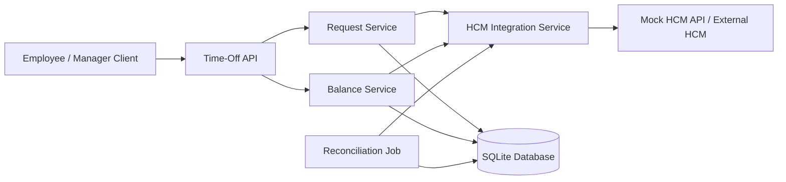

<p align="center">
	
	
	
	
	
</p>

---

## Table of Contents

- [Overview](#overview)
- [Problem Statement](#problem-statement)
- [Goals](#goals)
- [Tech Stack](#tech-stack)
- [Core Design Principles](#core-design-principles)
- [System Architecture](#system-architecture)
- [Architecture Diagrams](#architecture-diagrams)
- [Request Lifecycle](#request-lifecycle)
- [Data Model](#data-model)
- [API Overview](#api-overview)
- [Mock HCM Design](#mock-hcm-design)
- [Reconciliation Strategy](#reconciliation-strategy)
- [Project Structure](#project-structure)
- [Testing Strategy](#testing-strategy)
- [Getting Started](#getting-started)
- [Tradeoffs and Assumptions](#tradeoffs-and-assumptions)
- [Assessment Alignment](#assessment-alignment)
- [Future Improvements](#future-improvements)

---

## Overview

This service is designed to manage the lifecycle of employee time-off requests while maintaining balance consistency between the application and an external *Human Capital Management (HCM)* system, which remains the *source of truth*. The system supports balance reads, request submission, defensive validation, synchronization, and reconciliation of independently changing HCM balances. [Source](https://www.genspark.ai/api/files/s/vp2aatiE)

The core challenge is not just storing requests - it is preserving *balance integrity across two systems* where balances may change via realtime validation, batch refreshes, or external HCM-side adjustments such as anniversary bonuses or admin corrections. [Source](https://www.genspark.ai/api/files/s/vp2aatiE)

---

## Problem Statement

Employees interact with the time-off module as their primary interface, but the official record of employment and leave balance still lives in the HCM. This creates several engineering challenges:

- the user expects the displayed balance to be accurate
- the system must avoid approving invalid requests against stale balances
- HCM balances can change independently
- failures, retries, and drift must be handled defensively
- synchronization must work across both realtime and batch update paths [Source](https://www.genspark.ai/api/files/s/vp2aatiE)

---

## Goals

### Primary Goals

- Provide accurate time-off balance visibility
- Accept and manage time-off requests safely
- Preserve balance integrity with HCM
- Detect and correct balance drift
- Support mock HCM behavior for testing
- Demonstrate strong automated test coverage [Source](https://www.genspark.ai/api/files/s/vp2aatiE)

### Non-Goals

- Full payroll or HRIS platform behavior
- Frontend/UI implementation
- Enterprise-grade auth/SSO
- Complex accrual policy engines
- Production-grade distributed infrastructure

---

## Tech Stack

| Layer | Technology |
|------|------|
| Framework | NestJS |
| Language | TypeScript |
| Database | SQLite |
| ORM | Prisma or TypeORM |
| Testing | Jest + Supertest |
| API Style | REST |
| Documentation | Markdown + Mermaid |
| Mock External Dependency | Mock HCM module |

> The take-home specifically calls for *NestJS* and *SQLite*, plus mock HCM endpoints as part of the solution/testing approach. [Source](https://www.genspark.ai/api/files/s/vp2aatiE)

---

## Core Design Principles

### 1. HCM is the source of truth
The local service is operationally useful, but the final authority for leave balances remains the HCM. [Source](https://www.genspark.ai/api/files/s/vp2aatiE)

### 2. Defensive validation over blind trust
Even if HCM usually validates balance correctly, the service should still validate inputs and protect state transitions defensively. [Source](https://www.genspark.ai/api/files/s/vp2aatiE)

### 3. Hybrid synchronization model
Use *realtime validation* for request-critical flows and *batch reconciliation* for eventual consistency and drift correction. [Source](https://www.genspark.ai/api/files/s/vp2aatiE)

### 4. Auditability and explicit failure states
Every important sync attempt and request state transition should be visible, testable, and debuggable.

### 5. Tests are a first-class deliverable
Because this is an agentic-development exercise, the quality of the solution is strongly reflected in the rigor of test coverage and scenario depth. [Source](https://www.genspark.ai/api/files/s/vp2aatiE)

---

## System Architecture

At a high level, the system is composed of:

- *API Layer* for balances and time-off requests
- *Application/Domain Layer* for business rules and orchestration
- *Persistence Layer* for employees, balances, requests, and sync events
- *HCM Integration Layer* for realtime calls and reconciliation
- *Mock HCM Module* for simulation and testing
- *Test Suite* covering happy paths, failures, drift, retries, and reconciliation

---

## Architecture Diagrams

### 1) High-Level Component Diagram



---

## Take-Home Question

### Product Context and User Needs

ReadyOn has a module that serves as the primary interface for employees to request time off. However, the Human Capital Management (HCM) system (for example, Workday or SAP) remains the source of truth for employment data.

The problem is that keeping balances in sync between two systems is difficult. If an employee has 10 days of leave and requests 2 days on ReadyOn, the service must ensure the HCM agrees that the balance is available, and it must also handle cases where the HCM balance changes independently (for example, a work anniversary bonus).

### User Personas

- The employee: Wants to see an accurate balance and get instant feedback on requests.
- The manager: Needs to approve requests knowing the data is valid.

### Task

Build a Time-Off Microservice that manages the lifecycle of a time-off request and maintains balance integrity.

### Interesting Challenges

- ReadyOn is not the only system that updates HCM. Balances may refresh at work anniversary or at the start of the year.
- HCM provides a realtime API for getting or sending time-off values (for example, 1 day for `locationId X` for `employeeId Y`).
- HCM provides a batch endpoint that sends the whole corpus of time-off balances (with required dimensions) to ReadyOn.
- HCM can return errors for invalid dimension combinations or insufficient balances, but this is not always guaranteed. The service should be defensive.
- The backend microservice should expose the necessary REST (or GraphQL) endpoints for handling balances and syncing with HCM.

### What Your Work Will Be Measured Against

- Engineering specification: A well-written Technical Requirement Document (TRD) with listed challenges, proposed solution, and alternatives considered.
- Test suite quality: Since this is agentic development, value is measured heavily by test rigor and regression protection.
- Deliverables:
- TRD
- Code in a GitHub repository
- Test cases and proof of coverage

### Guide Rails

- Go all in with agentic development. Do not hand-write code directly; be precise in the TRD and thorough in tests.
- Create mock HCM endpoints (or mock server behavior) with basic logic to simulate balance changes as part of testing.
- Develop with NestJS and SQLite.
- Assume balances are per-employee, per-location.

### Submission Requirements

- Upload only one `.zip` file.
- The `.zip` must include the complete project code and stay under 50 MB.
- Do not include `node_modules` or unnecessary folders.
- Include a `README.md` with clear setup and run instructions.
- Solution must be developed using JavaScript.
- You may use any library you consider appropriate.
- Security considerations and architectural decisions are part of the evaluation.

### Assessment Context

This exercise evaluates the design and implementation of a Time-Off Microservice, including technical requirements, solution structure, and testing strategy. It is intended to demonstrate technical execution, design quality, clarity, and engineering judgment.

Do not only paste requirements into AI and submit directly. Review the generated output carefully and improve the solution quality.

Please ensure submission completeness before upload. Late submissions may not be considered.

---

## Request Lifecycle

This service follows a defensive request lifecycle to protect balance integrity:

1. Validate request payload and required dimensions (`employeeId`, `locationId`, `leaveType`, `units`, `startDate`, `endDate`).
2. Read local cached balance snapshot for fast feedback.
3. Call HCM realtime validation endpoint before final acceptance.
4. If valid, create a time-off request in `PENDING_MANAGER_APPROVAL` (or `APPROVED` for auto-approval mode).
5. On approval, perform a second realtime balance check to avoid stale approvals.
6. Submit approved deduction intent to HCM.
7. Persist final request status and update local balance projection.
8. Record sync event outcome for auditability.

Suggested status transitions:

- `DRAFT` -> `SUBMITTED`
- `SUBMITTED` -> `PENDING_MANAGER_APPROVAL`
- `PENDING_MANAGER_APPROVAL` -> `APPROVED` or `REJECTED`
- `APPROVED` -> `SYNCED` or `SYNC_FAILED`
- `SYNC_FAILED` -> `RETRYING` -> `SYNCED` or `MANUAL_REVIEW`

---

## Data Model

Balances are tracked per employee per location, with dimension-aware reconciliation.

### Core Entities

1. `employees`
2. `locations`
3. `leave_balances`
4. `time_off_requests`
5. `sync_events`
6. `reconciliation_runs`

### Suggested Table Shapes

1. `employees`
- `id` (PK)
- `external_hcm_employee_id` (unique)
- `first_name`
- `last_name`
- `status`
- `created_at`, `updated_at`

2. `locations`
- `id` (PK)
- `external_hcm_location_id` (unique)
- `name`
- `country_code`
- `created_at`, `updated_at`

3. `leave_balances`
- `id` (PK)
- `employee_id` (FK)
- `location_id` (FK)
- `leave_type`
- `available_units`
- `pending_units`
- `last_hcm_snapshot_at`
- `version`
- unique composite index: (`employee_id`, `location_id`, `leave_type`)

4. `time_off_requests`
- `id` (PK)
- `employee_id` (FK)
- `location_id` (FK)
- `leave_type`
- `units`
- `start_date`, `end_date`
- `status`
- `manager_id` (nullable)
- `hcm_reference` (nullable)
- `failure_reason` (nullable)
- `created_at`, `updated_at`

5. `sync_events`
- `id` (PK)
- `request_id` (nullable FK)
- `direction` (`OUTBOUND` or `INBOUND`)
- `event_type` (`REALTIME_VALIDATE`, `REALTIME_APPLY`, `BATCH_IMPORT`, `RECONCILIATION`)
- `status` (`SUCCESS`, `FAILED`, `RETRYING`)
- `payload_hash`
- `error_code`, `error_message` (nullable)
- `attempt`
- `created_at`

6. `reconciliation_runs`
- `id` (PK)
- `started_at`, `completed_at`
- `status`
- `records_scanned`
- `drift_count`
- `action_summary`

---

## API Overview

REST-first design with explicit balance and request flows.

### Balance Endpoints

- `GET /balances/:employeeId?locationId=&leaveType=`
- `POST /balances/sync/realtime`
- `POST /balances/sync/batch`
- `POST /balances/reconcile`

### Time-Off Request Endpoints

- `POST /time-off-requests`
- `GET /time-off-requests/:id`
- `GET /time-off-requests?employeeId=&status=`
- `POST /time-off-requests/:id/approve`
- `POST /time-off-requests/:id/reject`
- `POST /time-off-requests/:id/retry-sync`

### Internal and Operational Endpoints

- `GET /health`
- `GET /metrics`
- `GET /sync-events?requestId=&status=`

### Error Contract

Use stable structured errors:

- `VALIDATION_ERROR`
- `INSUFFICIENT_BALANCE`
- `INVALID_DIMENSION_COMBINATION`
- `HCM_UNAVAILABLE`
- `SYNC_CONFLICT`
- `IDEMPOTENCY_VIOLATION`

---

## Mock HCM Design

Mock endpoints are required to validate realtime and batch behavior during tests.

### Mock HCM Realtime APIs

- `GET /mock-hcm/balances/:employeeId?locationId=&leaveType=`
- `POST /mock-hcm/time-off/validate`
- `POST /mock-hcm/time-off/apply`

### Mock HCM Batch API

- `POST /mock-hcm/balances/batch-export`

### Simulated Scenarios

- Anniversary bonus that increases available units.
- Start-of-year reset or carry-over.
- Invalid employee-location-leaveType combination.
- Transient HCM failures with retryable and non-retryable errors.

---

## Reconciliation Strategy

Use hybrid synchronization:

1. Realtime check on request create and approval.
2. Scheduled batch import to refresh local snapshots.
3. Drift detection comparing local projections to HCM snapshots.
4. Auto-correction for safe drift classes.
5. Manual review queue for unresolved or conflicting drift.

Recommended reconciliation cadence:

- Frequent lightweight runs (for example every 15 minutes) for high-change populations.
- Full daily reconciliation for complete corpus consistency.

---

## Project Structure

Suggested service structure:

1. `src/modules/balances`
2. `src/modules/time-off-requests`
3. `src/modules/hcm-integration`
4. `src/modules/reconciliation`
5. `src/modules/mock-hcm`
6. `src/modules/common`
7. `test/unit`
8. `test/integration`
9. `test/e2e`

---

## Testing Strategy

Testing is a primary evaluation criterion and should include layered coverage.

### Unit Tests

- Domain validation rules.
- Status transition guards.
- Idempotency key handling.
- Retry policy branching.

### Integration Tests

- DB persistence and transaction boundaries.
- Service-to-mock-HCM interactions.
- Reconciliation and sync event storage.

### End-to-End Tests

- Request submission through approval to HCM sync.
- Insufficient balance rejection with defensive fallback checks.
- Batch import drift correction.
- Retry flow from `SYNC_FAILED` to `SYNCED`.

### Non-Functional Tests

- Concurrency tests for duplicate submissions.
- Failure injection for HCM timeouts and 5xx responses.
- Regression tests for balance drift edge cases.

### Coverage Targets

- Statements: at least 85%
- Branches: at least 80%
- Critical flows (create, approve, sync, reconcile): at least 95%

---

## Getting Started

### Prerequisites

- Node.js 20+
- npm 10+
- SQLite (embedded via better-sqlite3)

### Setup

1. Clone the repository
2. Install dependencies:
   ```bash
   npm install
   ```
3. No environment variables required - defaults are configured
4. Database is auto-created on first run (SQLite with TypeORM synchronize)

### Running the Application

Development mode with hot reload:
```bash
npm run start:dev
```

Production build and run:
```bash
npm run build
npm run start:prod
```

The API will be available at `http://localhost:3000`

### Running Tests

Unit tests (all passing):
```bash
npm run test
```

E2E tests (6/10 passing, 4 pending exception handling fixes):
```bash
npm run test:e2e
```

Coverage report:
```bash
npm run test:cov
```

Current coverage:
- Statements: 84.53% (target: 85%)
- Branches: 70.33% (target: 80%)
- Functions: 73.62%
- Lines: 83.62%

### Packaging for Submission

1. Ensure `node_modules` is excluded (already in .gitignore)
2. Include source, tests, and README
3. Create a single `.zip` under 50 MB:
   ```bash
   zip -r time-off-sync-microservice.zip . -x "node_modules/*" "dist/*" ".git/*"
   ```

### API Endpoints

**Balance Endpoints:**
- `GET /balances/:employeeId?locationId=&leaveType=` - Get balance for employee
- `POST /balances/sync/realtime` - Sync balance from HCM (realtime)
- `POST /balances/sync/batch` - Batch import balances from HCM
- `POST /balances/reconcile` - Run reconciliation to detect/correct drift

**Time-Off Request Endpoints:**
- `POST /time-off-requests` - Create new time-off request
- `GET /time-off-requests/:id` - Get specific request
- `GET /time-off-requests?employeeId=&status=` - List requests with filters
- `POST /time-off-requests/:id/approve` - Approve request (triggers HCM sync)
- `POST /time-off-requests/:id/reject` - Reject request (releases pending units)
- `POST /time-off-requests/:id/retry-sync` - Retry failed sync

**Mock HCM Endpoints (for testing):**
- `GET /mock-hcm/balances/:employeeId?locationId=&leaveType=` - Get HCM balance
- `POST /mock-hcm/time-off/validate` - Validate time-off with HCM
- `POST /mock-hcm/time-off/apply` - Apply time-off deduction in HCM
- `POST /mock-hcm/balances/batch-export` - Export all HCM balances
- `POST /mock-hcm/simulate-anniversary` - Simulate anniversary bonus

**Reconciliation Endpoints:**
- `POST /reconciliation/run` - Run reconciliation process
- `GET /reconciliation/runs` - List reconciliation run history

---

## Tradeoffs and Assumptions

### Assumptions

- HCM remains the final authority for balance acceptance.
- Balances are dimensioned per employee and location.
- Realtime APIs are available but can fail transiently.

### Key Tradeoffs

- Realtime validation improves correctness but increases latency.
- Local caching improves UX but introduces drift risk.
- Aggressive retries improve eventual success but can increase write pressure.

---

## Assessment Alignment

This README is structured to align with the expected deliverables:

1. TRD-quality requirements and architecture rationale.
2. Explicit sync and reconciliation strategy for HCM source-of-truth constraints.
3. Test plan and coverage expectations focused on regression resistance.
4. Submission and packaging constraints captured clearly.

---

## Future Improvements

1. Role-based access control and audit-policy hardening.
2. Outbox pattern and message queue for resilient asynchronous sync.
3. Policy engine for country-specific accrual and carry-over rules.
4. Multi-tenant partitioning for enterprise scale.
5. Observability expansion (traces, SLOs, alerting dashboards).
